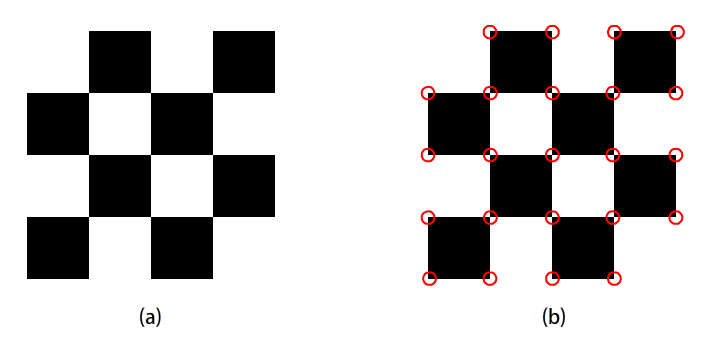
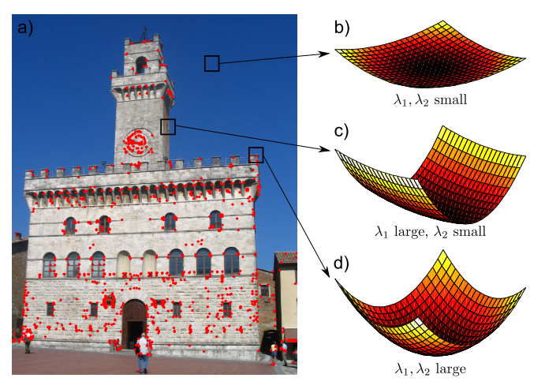
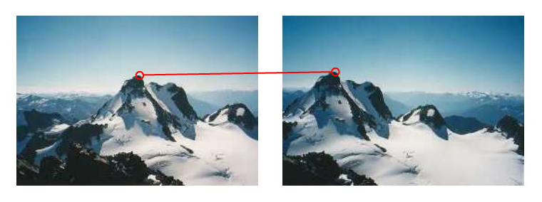
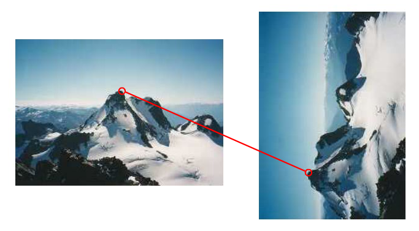
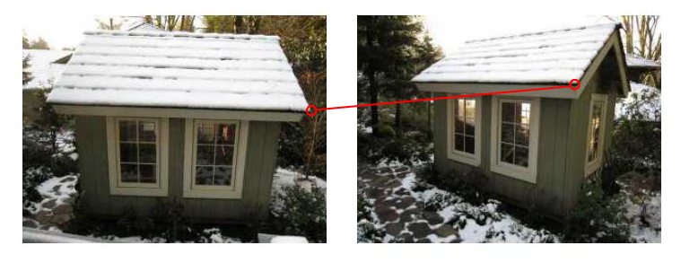

<link rel="stylesheet" href="styles.css">

# Project Title
#### Aziz Shaik and Bug Lee
#### Fall 2021 ECE 4554 Computer Vision: Course Project
#### Virginia Tech
---
## Abstract

---
## Introduction

Although computer vision is a relatively new topic, great amounts of time and effort have been put into by professionals and researchers in the last few decades. As a result, many sophisticated algorithms have been developed that most computer vision application are built upon today. Fortunately, those algorithms are packaged and encapsulated into commercial/open-source libraries, so that user can focus on its application.  

As a student in Computer Vision course however, our goal is to gain concrete idea of some of the well-known topics in computer vision by creating our own library from scratch. Topics include Harris corner detector, SIFT descriptor, and nearest neighbor matching which lay foundation for many correspondence problem in computer vision. The focus of the project is not to create a library that can compete with known library such as OpenCV, but to gain deeper understanding of existing libraries and ability to implement ideas for a existing/future computer language that may not have support for computer vision and its application.

---
## Approach

- We will first prototype the library using Python since it reduce the burden of creating helper functions such as vector/matrix multiplication, displaying image buffer, and array/list manipulation. Two libraries that will be used are: 
  - NumPy
  - Python Imaging Library (PIL)
- During the prototyping step, we will also analyze what part of the algorithm is causing the performance bottleneck. This will provide better understanding of strengths and weaknesses of the given algorithm in computer vision and suggest when and where to use it for best performance.
- Each function will be unit tested for correctness by comparing output with corresponding OpenCV library function.  
- Transition to C++ will be consider once we identify all the algorithms are implemented correctly and after the unit testing step.
  
---

## Harris corner detector
### **Pseudo code**
Following pseudo code describe the algorithm of Harris corner detector.

    Convert the given image to gray scale. 
    Compute the gradient components at each point in the image
    Create the M matrix from the gradient components
    Compute the eigenvalues of M
    Compute Harris response. 
    Find points with large response (above certain threshold)
    Choose the local maximum of those points as features

 Note that Harris response will be approximated to
 $$
 \lambda_{min} \approx \frac{determinant(M)}{trace(M)}
 $$

 ### **Experiments and Result**
First, basic test will be perform using following image (Figure 1).
Then, more advance test will be perform by comparing the result with Harris detector from OpenCV (Figure 2).

#### Figure 1. (a)Input image, (b)Expected output. Red circles indicate feature points.  

` `

#### Figure 2. Output using existing library such as OpenCV. Image was copied from the *Computer vision: models, learning and inference* by Simon Prince [1]. 

` `

Using the same same threshold value, tests will consider success if
1. Difference in number of feature points between our implementation and existing library function is within 10%.  
2. Positions of resulting local maxima(s) match with the output from the existing library function.
3. Performance difference is within the range of few magnitude. This is only use as a rough guideline to check whether we are not introducing unnecessary computation or performance bottleneck in our implementation.

---
## SIFT descriptor
Following pseudo code was adapted from the *Computer vision: models, learning and inference* by Simon Prince [1]. 

    Compute gradient orientation and amplitude maps over a 16 X 16 pixel region around the interest point
    Divide 16 X 16 detector region into a regular grid of non-overlapping 4x4 cells
    Within each of these cells, compute an 8 dimensional histogram of the image orientations
    Weight the histogram by the associated gradient amplitude and by distance 
    Concatenate 16 histograms to make 128 X 1 vector
    Normalize the vector

 ### **Experiments and Result**
 Certain well-defined feature points will be manually selected for the purpose of this testing. This will lead to automatic and more sophisticated matching problem in the next section. Correctness of the descriptor will be evaluated through 3 separate tests. Tests will be consider success only if all following 3 tests pass. Note that all images below were copied from the *Computer Vision: Algorithms and Applications* by Richard Szeliski [2].
 1. Matching feature points where two images are differ by translation (Figure 3)
 2. Matching feature points where two images are differ by rotation (Figure 4)
 3. Matching feature points where two images are differ by different point of view (Figure 5)
   

#### Figure 3. Two images differ by translation. Two red circles are expected to hold matching descriptor.

#### Figure 4. Two images differ by rotation. Two red circles are expected to hold matching descriptor.

#### Figure 5. Two images differ by point of view. Two red circles are expected to hold matching descriptor.

Again, once the above 3 tests pass, result will be compare to the SIFT function from existing library. Following to tests should pass for pre-selected feature points:

1. Computed vector matches with the output vector from exiting library. 
2. Performance difference is within the range of few magnitude. This is only use as a rough guideline to check whether we are not introducing unnecessary computation or performance bottleneck in our implementation.

---
## Nearest neighbor matching

---
## Qualitative results

---
## Conclusion

---
## References
[1] Simon Prince, *Computer vision: models, learning and inference*, Cambridge University Press, 2012.  
[2] Richard Szeliski, *Computer Vision: Algorithms and Applications*, 2nd Edition, Springer, 2021.

---
#### © Aziz Shaik and Bug Lee

