<link rel="stylesheet" href="styles.css">

# Manual Implementation and Analysis of Selected Correspondence-Related Functions
#### Aziz Shaik and Bug Lee
#### Fall 2021 ECE 4554 Computer Vision: Course Project
#### Virginia Tech  

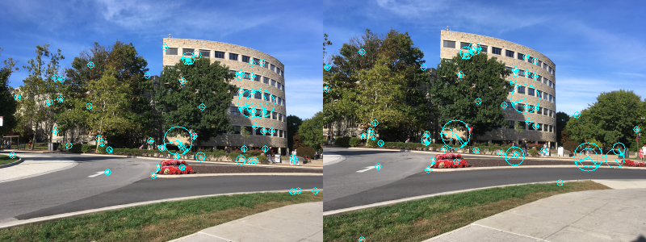

---
# Abstract
Problem related to correspondence have been around the computer vision for a while now and many clever approaches were developed in a last few decade to address such issue. Now due to the shift in interest in computer vision community, it is easy to overlook the bright idea behind the algorithm that what now people consider as 'old'. Goal of this project was to gain insight on few selected libraries/functions related to correspondence by re-implementing from ground up. SIFT detector/descriptor, and Nearest Neighbor matching was chosen as they have been proven to be robust and many have successfully used for real world application. SIFT detector/descriptor was implemented based on the David Lowe's paper, _Distinctive Image Features from Scale-Invariant Keypoints_, where it provide all the parameters that we have used during the implementation. Although the robustness and performance of our implementations are nowhere near the commercial version, we have successfully implemented working version of SIFT detector/descriptor and Nearest neighbor matching.

---
# Introduction

Although computer vision is a relatively new topic, great amounts of time and effort have been put into it by professionals and researchers in the last few decades. As a result, many sophisticated algorithms have been developed that most computer vision applications are built upon today. Fortunately, those algorithms are packaged and encapsulated into commercial/open-source libraries, so that users can focus on its application.  

As a student in the Computer Vision course, however, our goal is to gain a concrete idea of some of the well-known topics in computer vision by creating our own SIFT library from scratch. Topics include SIFT detector, SIFT descriptor, and nearest-neighbor matching which lay the foundation for many correspondence problems in computer vision. The focus of the project is not to create a library that can compete with a known library such as OpenCV, but to gain a deeper understanding of existing libraries and the ability to implement ideas for an existing/future computer language that may not have support for computer vision and its application.

---
# Approach

- We have prototype the library using Python since it reduces the burden of creating helper functions such as vector/matrix multiplication, displaying image buffer, and array/list manipulation. Two libraries that will be used are: 
  - NumPy
  - Python Imaging Library (PIL)
  - OpenCV (only the following functions)
    - *resize()*
    - *imshow()*
    - *imread()*
    - *cvtColor()*
    - *circle()*
    - *arrowedLine()*
    - *line()*
- During the prototyping step, we have performed empirical analysis on what part of the algorithm is causing the performance bottleneck. This have provide a better understanding of the strengths and weaknesses of the given algorithm in computer vision and suggest what part could have been improved. 
- Some of the code from the homework assignments were reused with no or moderate modification. All source code are publicly available inside the GitHub.
  - *liner_filter()*
  - *gaussian()* and *gaussianKernel()*
  - *sub_sample()*, which is a modified version of *simulate_lower_resolution()*

---
 
# SIFT detector/descriptor
## **1. Pseudo code**
Following pseudo code describe the algorithm of SIFT detector. The algorithm was adapted from the Lowe's paper, _Distinctive Image Features from Scale-Invariant Keypoints_ and Sinha's web tutorial, _SIFT: Theory and Practice_[1, 2].

    Convert the given image to gray scale. 
    Generate Gaussian pyramid of the base image.
    Generate scale space, 4 octave and 5 level, from the Gaussian pyramid.
    Approximate Laplacian of Gaussian (LoG) by computing Difference of Gaussian (DoG).
    Locate maxima, potential key points, from the DoG.
    Remove low contrast and/or edge from the potential key points.
    Assign orientation to the each key points.
    Assign feature to each key points.

## **2. Input image**
The following image was used for implementing SIFT detector (Figure 1). However, actual image that was used for entire SIFT detector algorithm is a converted gray scale image (Figure 2).

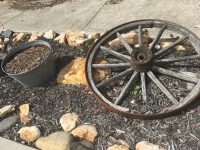
#### Figure 1. Input image for SIFT detector  

#### Figure 2. Converted gray scale image. This is the actual image that was used for entire computation   

>
## **3. Gaussian pyramid**
SIFT detector first has to generate scale space, representing different scale of the input image. Gaussian pyramid was used to prepare for this, where it set up 4 octave layers as recommended in the Lowe paper [1]. Note that first layer of the pyramid is a up-sampled image. This was done to account for removal of high frequencies in original image due to pre-smoothing [1].

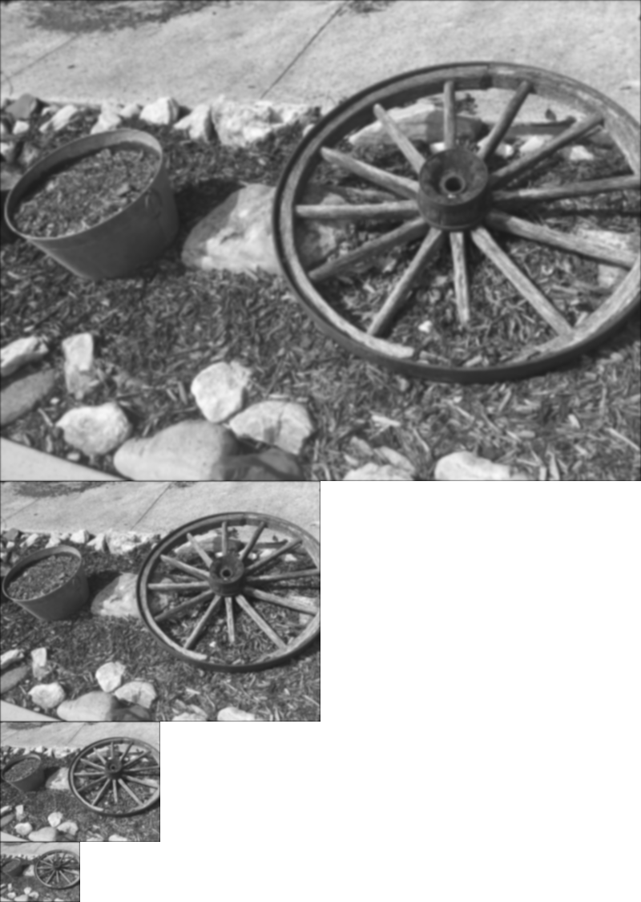
#### Figure 3. Gaussian pyramid of the input image.

## **4. The scale space**
As mention above, scale space represent different scale of the input image. This was necessary to identify 'blob' with the appropriate size, making SIFT detector scale invariant. Several layer of level was added to each of the octave. The idea was to progressively remove the detail, or higher frequency, of the input image through each level. Gaussian smoothing with parameter $k^i \sigma$ was applied to corresponding level, where $k = \sqrt{2}, \sigma = 1.6,$ and $i$ is the level within the octave. In addition to 4 octave layers that was generated from the Gaussian pyramid, adding 5 layers of level layers to each octave layer gave a finer control over scaling. Note that all the values were directly adapted from the Lowe's paper.

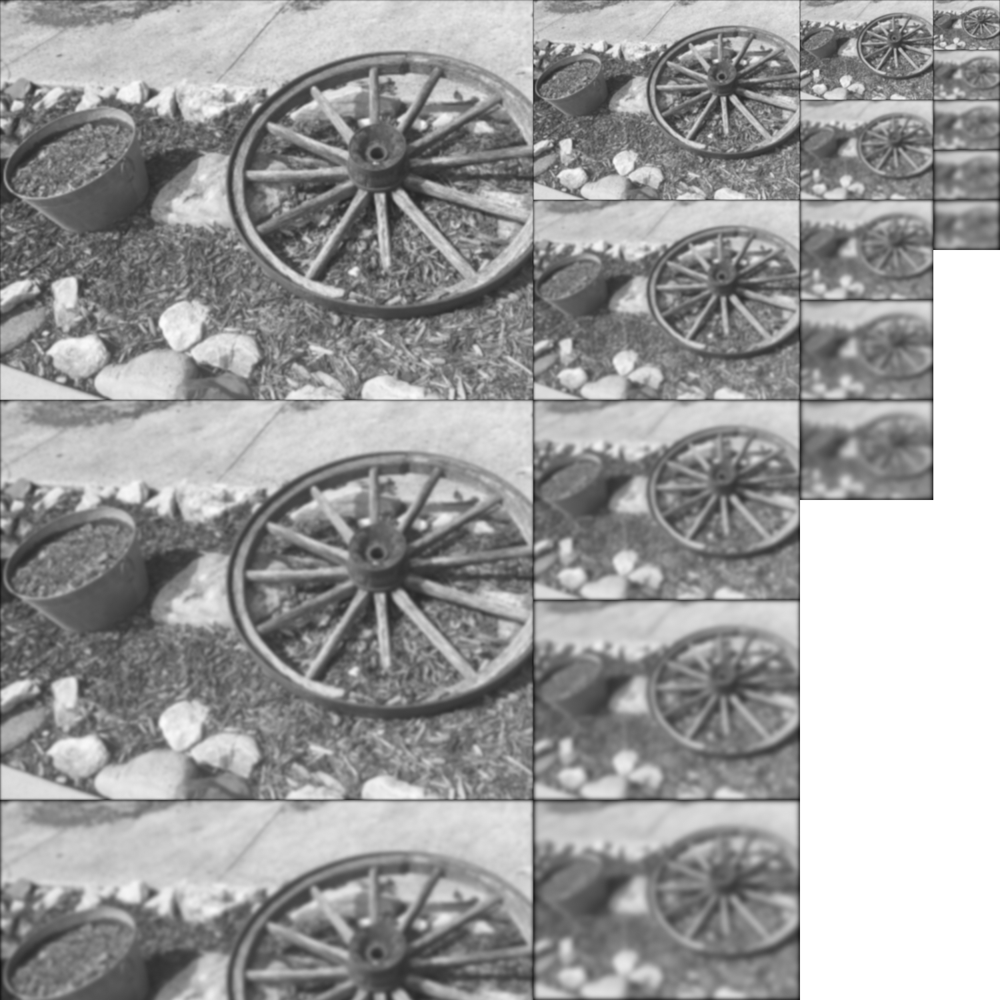
#### Figure 4. Generated scale space of the input image. Some of the images were cut off.

## **5. LoG approximations**
The Laplacian of Gaussian (LoG) is a well known operation to locate edges and corners in the image. However, as discussed in the performance section, applying kernel to all images in the scale space is a computationally expensive task. Lowe's paper suggested a clever trick; (with the right set up) Difference of Gaussian (DoG) can closely approximate the LoG. Since scale space have been already computed with the Gaussian smoothing, only task left to do was subtracting image at the current level with the next level.  

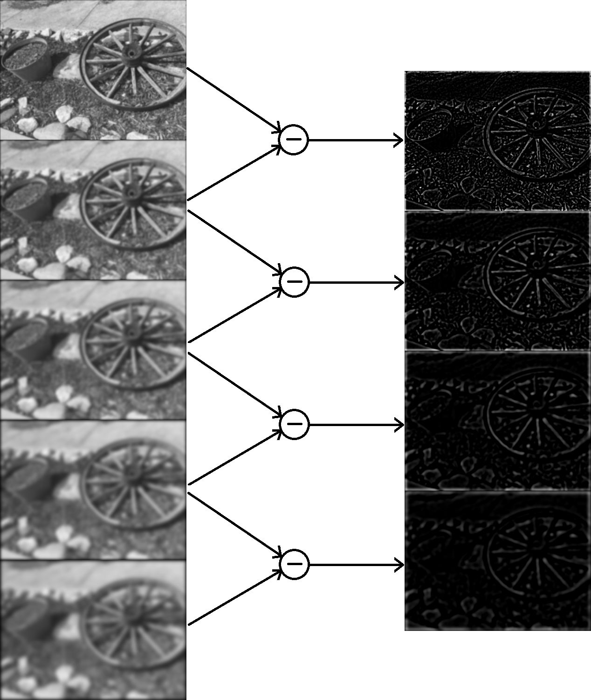
#### Figure 5. Computing Difference of Gaussian using scale space. This figure only represent the computation in one octave. Also note that output magnitude was magnified for clearer visual.

## **6. Computing local maxima**
The DoG from the previous section contains information about edges and corners. As a next step to identify potential key points, local maxima was computed for each pixel. However, unlike 2 dimensional local maxima computation which only check for 8 neighboring pixels that surround the center pixel, 3 dimensional local maxima was needed. Therefore, in addition to 8 neighboring pixels, 9 pixel from the level above and 9 pixel from the level below, total of 26 was checked to see if the referencing center pixel was a local maxima. (Figure 6)

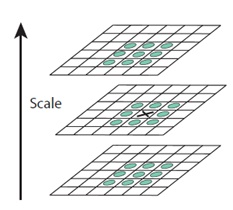
#### Figure 6. 3D local maxima. 26 neighboring pixels was checked to see if the referencing center pixel was a local maxima. Image was copied from the Lowe's paper [1]. 

The idea was to identify the potential key points at the most appropriate scale. Note that top most and bottom most level were ignored since those do not have either layer above or below for 3D maxima. This is the reason why up-sampled input image was added during the Gaussian pyramid generation.

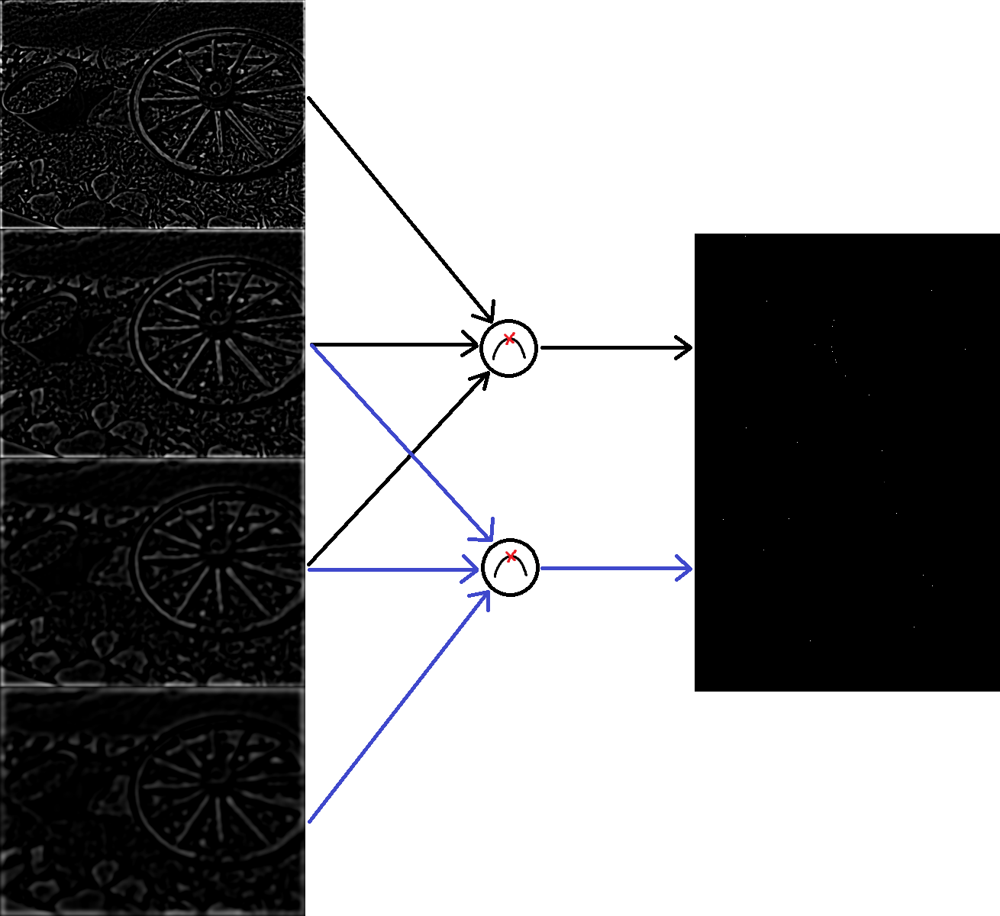
#### Figure 7. Computing local maxima from using result from DoG. This figure only represent the computation in one octave. Again, output magnitude was magnified for clearer visual. 

## **7. Removing low contrast points and edges**
Once the potential key points were identified from the previous section, additional checking was performed to remove low contrast points and edges. Removing low contrast points was done by setting a threshold. Threshold of 0.03 (in 0-1 scale) was suggested in the Lowe's paper, so 7.65 (0-255 scale) was used for our implementation. On the other hand, Hessian matrix was used to determine principal curvature and remove edges. 
$$ Tr(H) = D_{xx} + D_{yy} $$
$$ Det(H) = D_{xx}D_{yy} - (D_{xy})^2 $$
Where key point at $(x,y)$ was consider as an edge when 
$$ \frac{Tr(H)^2}{Det(H)} > \frac{(r+1)^2}{r}$$
The threshold $r=10$ was used for our implementation as Lowe suggested in his paper.

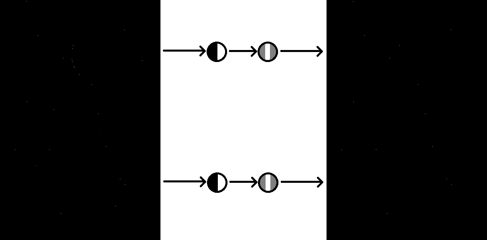
#### Figure 8. Removal of edge and low contrast points from the result obtain from the previous section. This figure only represent the computation in one octave. Again, output magnitude was magnified for clearer visual.

## **8. Orientation of key points**
As a final step for the SIFT detector (one step before SIFT descriptor), orientation was assigned to each key points. The orientation was determined by generating histogram with 36 bin, each bin representing 10 degrees in range, and taking the bin with maximum value. We have also call this a 'voting' method. First, point and neighborhood that would contribute to voting was selected. The size of the neighborhood was determined by the scale $\sigma$ of the point, which can be calculated by finding which octave and level the point associate with. Then, magnitude and angle of each pixel within the neighborhood was calculated using the formula from the Lowe's paper:
$$ m(x,y) = \sqrt{(L(x+1, y) - L(x-1,y))^2 + (L(x,y+1) - L(x,y-1))^2} $$
$$ \theta(x,y) = \tan^{-1}((L(x,y+1)-L(x,y-1)) / (L(x+1,y)-L(x-1,y)))$$
where $L$ is a Gaussian smoothed image from the scale space determine by the scale of the selected key point.  
Once the magnitude and angle was found, then the pixel would 'vote' to one of the 36 bins that it correspond with. For example, if angle of the pixel was found to be 24, it would vote to bin 2 which represent angle range between 20-29 degrees. Also note that voting is weighted by the magnitude, so that pixel with higher magnitude contribute more. After all pixel within the neighborhood voted, the bin with the highest vote will be the orientation of the selected key point.
Lowe's paper also suggested to create new key points with orientations that were close to the peak (with in 80%) for increase stability during key point matching. Therefore, Our implementation have incorporated that as well.

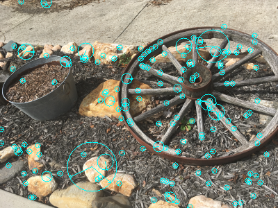
#### Figure 9. Resulting key points after orientation assignment. Note that scale representation of key points were magnified by factor of 2 for clearer visual.

## **9. Generating SIFT feature**
Using the SIFT key points (which contain information about its location, scale, and orientation) generated from the previous step, now SIFT feature can be generated. 
The following pseudo code was used for our implementation. It was adapted from the *Computer vision: models, learning and inference* by Simon Prince [3]. 

    Compute which octave and level should be use from the scale space
    Compute gradient orientation and amplitude maps over a 16 X 16 pixel region around the interest point
    Divide 16 X 16 detector region into a regular grid of non-overlapping 4x4 cells
    Within each of these cells, compute an 8 dimensional histogram of the image orientations
    Weight the histogram by the associated gradient amplitude and by distance (using Gaussian curve) 
    Concatenate 16 histograms to make 128 X 1 vector
    Normalize the vector

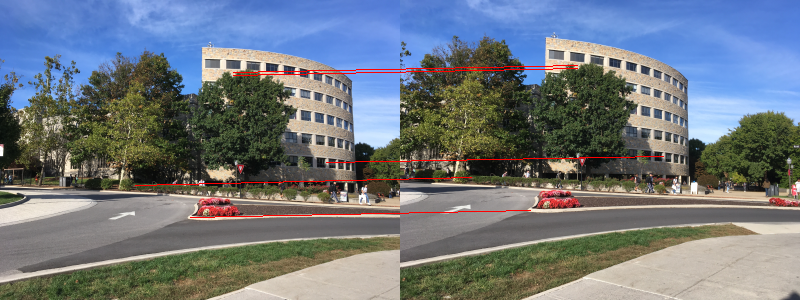
#### Figure 10. Result of SIFT detector (top) and matching SIFT feature (bottom). 

## **10. Qualitative results**
Key points and features were generated using SIFT detector/descriptor for this testing. The following tests were made for its correctness. Note that this was tested before nearest neighbor matching was implemented.
 1. Two images are differed by translation (Figure 12)
 2. Two images are differed by rotation (Figure 13)
 3. Two images are differed by scale (Figure 14)
 4. Two images are differed by different points of view (Figure 15)

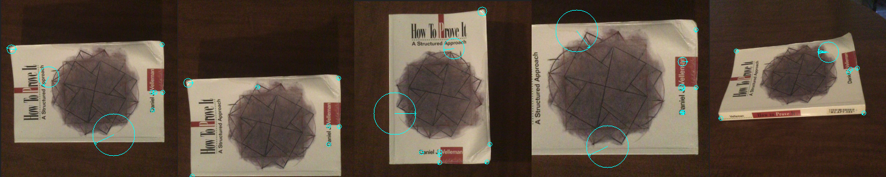
#### Figure 11. Resulting key points from SIFT detector. Image with low number of key points were chosen for the purpose of this tests.
 
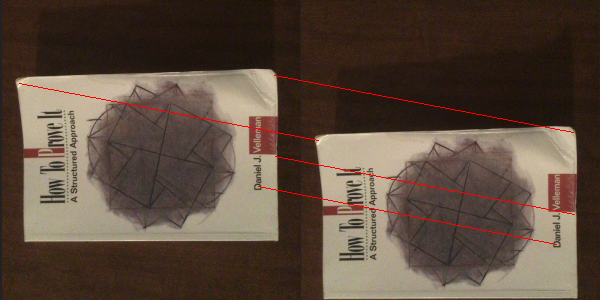
#### Figure 12. Two images differ by translation.

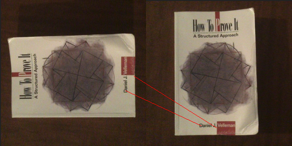
#### Figure 13. Two images differ by rotation.

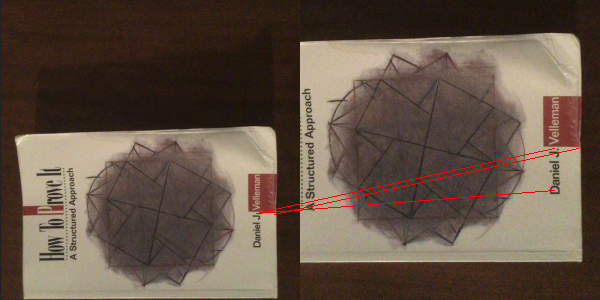
#### Figure 14. Two images differ by scale.

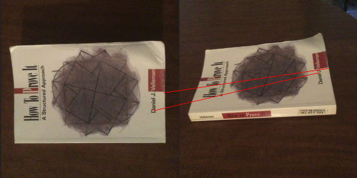
#### Figure 15. Two images differ by point of view.

## **11. Performance**
As shown below, there are 3 major bottle neck present in our implementation: Gaussian pyramid generation, scale space generation, and low contrast and edge removal process. Although time complexity of all functions, except sift descriptor, are quadratically grow as the input image size doubled, first two functions are affected more heavily as those involve applying Gaussian kernel to each pixel. Unless there is a alternative and more efficient way of applying kernel, performance of Gaussian pyramid and scale space generation always will be the limiting factor. On the other hand, low contrast and edge removal can be improve. For simplicity reason, we have implemented _locate_maxima()_ to return entire image instead of array of key points. However, since the number of potential key points that generated from the _locate_maxima()_ are generally much lower than the number of pixels in the image, latter implementation would have made our SIFT operation faster.

| Function | 200 x 150 | 400 x 300 | 800 x 600 |
| -------- | :--------------: | :----: | :---: |
| Gaussian pyramid | 4.20 s | 17.19 s | 67.49 s |
| Scale space | 8.90 s | 36.47 s | 143.36 s |
| Difference of Gaussian | 0.12 s | 0.45 s | 1.69 s | 
| Locate maxima | 1.43 s | 5.57 s | 22.28 s |
| Low contrast and edge removal | 5.73 s | 22.75 s | 93.32 s |
| Orientation assignments | 0.24 s | 0.86 s | 3.47 s |
| Generating SIFT features | 0.70 s | 1.99 s | 12.42 s |

#### Figure 16. Performance results. Label on the top represent input image size. 

---
# Nearest neighbor matching
## **1. Approach**
For this component, descriptors were presumed to have been calculated by SIFT or some other descriptor algorithm, and with some distance function (L1 norm or L2 norm), the distances between the various descriptors were calculated. Based on these calculated values, the two lowest distances were used to calculate the Nearest Neighbor Distance Ratio (NNDR). When compared to the user inputted threshold, if the computed NNDR is lower, the descriptors in question are not considered to be matching

Note that the NNDR is defined below, where <em>d</em>1 is the distance between <em>D</em>A, an arbitrary descriptor in the reference image, and <em>D</em>B, the closest descriptor in the transformed image, while <em>d</em>2 is the distance between <em>D</em>A and <em>D</em>C, the second closest descriptor in the transformed image [4].

$$\text{NNDR}=\frac{d_1}{d_2}=\frac{\left \| D_A-D_B \right \|}{\left \| D_A-D_C \right \|}$$

In order to use the created nn_match function, the user had to input the following parameters:
*kp_src: Source Keypoints, shape (N, 2)
*kp_dst: Destination Keypoints, shape (N, 2)
*desc_src: Source Descriptors, shape (N, 128)
*desc_dst: Destination Descriptors, shape (N, 128)
*t: Threshold to compare NNDR to
*d_func: Distance function to be used, L1 or L2

Although testing did not return good results for the L2 distance function and the L1 distance function giving far better results, this option was still put in for the user to decide.

## **2. Results**
We can start by examining some results for the L2 distance function with the nearest neighbor matching, which are as follows with 102 keypoints and a threshold of 0.99. Of those 102 keypoints, it has located 42 matches, of which none are correct. Figure 17 shows the same distance function, with only 15 matches, of which none are correct either. A common trend with this matching algorithm is that as the threshold is decreased, the number of matches found also decreases.

#### Figure 16. L2 norm distance function with 0.99 threshold 

#### Figure 17. L2 norm distance function with 0.98 threshold 

When the L2 norm distance function is used with a threshold of less than 0.98, no matches are found.

The more successful distance function was the L1 norm distance function, or the Manhattan distance function. Figure 18 shows the matches between the two images and it finds 85 matches here. The accuracy of these matches is noticeably higher than the L1 norm distance function, but there are still quite a few erroneous matches. If the threshold is lowered down to 0.75 as shown in Figure 19, this error rate is drastically decreased and there is only 1 incorrect match out of 36 matches found. Eventually reducing the threshold down to 0.7 results in Figure 20 with 34 matches, all correct.

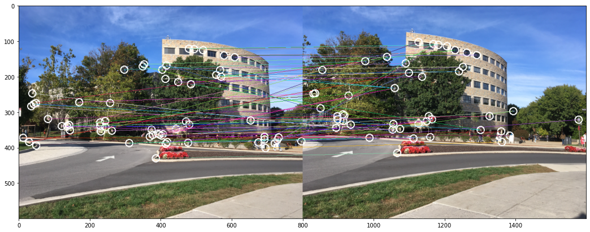
#### Figure 18. L2 norm distance function with 0.98 threshold 

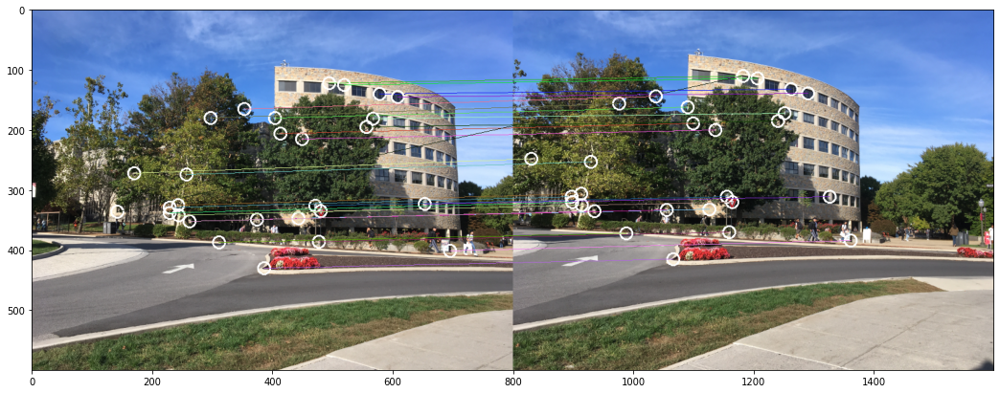
#### Figure 19. L2 norm distance function with 0.75 threshold 

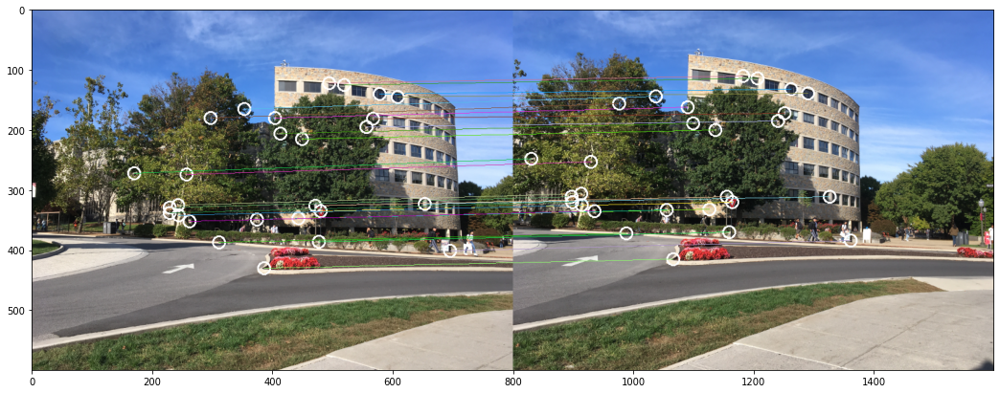
#### Figure 20. L2 norm distance function with 0.70 threshold 

While the L2 norm distance function proved to be unsuccessful, this was compensated by the success of the L1 norm distance function within the algorithm. In future iterations of this project, using the L1 norm distance function could be optimized to return more matching keypoints, instead of simply the 34 matches out of 102 keypoints found with the best performing threshold. 

In terms of computational analysis, the distance function calculations took the most time so these were the ones that are shown in the table below. One general trend that can be seen is that the lower the threshold, the greater amount of time it takes as lower thresholds result in more matches being compared with and thus, more distances computed.

| Distance Function | Threshold | Time Taken (Distance Calculation) (s) | Time Taken (Overall) (s) |
|-------------------|-----------|---------------------------------------|--------------------------|
| L1                | 0.25      | 1.355                                 | 1.357                    |
| L1                | 0.50      | 1.300                                 | 1.305                    |
| L1                | 0.75      | 1.301                                 | 1.311                    |
| L1                | 0.99      | 1.298                                 | 1.307                    |
| L2                | 0.25      | 4.494                                 | 4.471                    |
| L2                | 0.50      | 4.462                                 | 4.503                    |
| L2                | 0.75      | 4.451                                 | 4.497                    |
| L2                | 0.99      | 4.456                                 | 4.

---
---
# Conclusion
Through re-implementation of some of the popular computer vision library ourselves, we were able to see many clever ideas and insights into how researchers attempted to approach the correspondence problem. SIFT detector/descriptor in particular assemble several idea that are common in computer vision in one place and require multiple steps to produce the useful SIFT features. It first need to generate scale space, where each octave and level progressively hide away detail to represent image in bigger scale. It then use computed scale space to compute DoG, which is approximate LoG. From the edges and corners obtain from the DoG, it find the local maxima, potential key points. Set of key points are refined by removing key points with low contrast or edges. Key points that survived would then get the orientation assigned, where neighboring pixels surrounds the key points vote for its best representing orientation. Only after all this step, we have obtained what we called SIFT key points. Obtaining a SIFT feature required one more step, neighboring pixels were sub-divided into 16 regions, where each region compute 8x1 vector base on the similar voting technique used for orientation assignment, then combine all resulting vectors to form 128x1 descriptor representing a feature. Performance was bottle necked during the scale space generation step. We believe that such bottle neck cannot be avoided unless there is better alternative for applying Gaussian kernel. On the other hand, some speed up can be done by changing our implementation to return list of key points instead of entire image during the mid step. Additionally, the Nearest Neighbor matching algorithm implementation proved to be successful when used with the Manhattan distance function with little performance issues that could be reduced any further. To conclude, we were able to achieve our initial goals of implementing several key computer vision functions in order to gain a better understanding of their implementation and how they function.

---
# References
[1] David Lowe, "Distinctive Image Features from Scale-Invariant Keypoints", Computer Science Department, University of British Columbia, Vancouver, B.C, Canada, 2004.  
[2] Utkarsh Sinha. "SIFT: Theory and Practice". AI Shack. https://aishack.in/tutorials/sift-scale-invariant-feature-transform-introduction/. (Accessed December 6, 2021).  
[3] Simon Prince, *Computer vision: models, learning and inference*, Cambridge University Press, 2012.  
[4] K. Mikolajczyk and C. Schmid, <em>A Performance Evaluation of Local Descriptors</em>, 2005. 
---
#### © Aziz Shaik and Bug Lee

