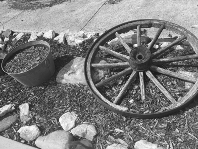

<link rel="stylesheet" href="styles.css">

# Project Title
#### Aziz Shaik and Bug Lee
#### Fall 2021 ECE 4554 Computer Vision: Course Project
#### Virginia Tech  

---
# Abstract

---
# Introduction

Although computer vision is a relatively new topic, great amounts of time and effort have been put into it by professionals and researchers in the last few decades. As a result, many sophisticated algorithms have been developed that most computer vision applications are built upon today. Fortunately, those algorithms are packaged and encapsulated into commercial/open-source libraries, so that users can focus on its application.  

As a student in the Computer Vision course, however, our goal is to gain a concrete idea of some of the well-known topics in computer vision by creating our own SIFT library from scratch. Topics include SIFT detector, SIFT descriptor, and nearest-neighbor matching which lay the foundation for many correspondence problems in computer vision. The focus of the project is not to create a library that can compete with a known library such as OpenCV, but to gain a deeper understanding of existing libraries and the ability to implement ideas for an existing/future computer language that may not have support for computer vision and its application.

---
# Approach

- We have prototype the library using Python since it reduces the burden of creating helper functions such as vector/matrix multiplication, displaying image buffer, and array/list manipulation. Two libraries that will be used are: 
  - NumPy
  - Python Imaging Library (PIL)
  - OpenCV (only the following functions)
    - *resize()*
    - *imshow()*
    - *imread()*
    - *cvtColor()*
    - *circle()*
    - *arrowedLine()*
    - *line()*
- During the prototyping step, we will also analyze what part of the algorithm is causing the performance bottleneck. This will provide a better understanding of the strengths and weaknesses of the given algorithm in computer vision and suggest when and where to use it for best performance. 
- Some of the code from the homework assignments were reused with no or moderate modification. All source code are publicly available inside the GitHub.
  - *liner_filter()*
  - *gaussian()* and *gaussianKernel()*
  - *sub_sample()*, which is a modified version of *simulate_lower_resolution()*

---
 
# SIFT detector/descriptor
## **1. Pseudo code**
Following pseudo code describe the algorithm of SIFT detector. The algorithm was adapted from the Lowe's paper, _Distinctive Image Features from Scale-Invariant Keypoints_ [1].

    Convert the given image to gray scale. 
    Generate Gaussian pyramid of the base image.
    Generate scale space, 4 octave and 5 level, from the Gaussian pyramid.
    Approximate Laplacian of Gaussian (LoG) by computing Difference of Gaussian (DoG).
    Locate maxima, potential key points, from the DoG.
    Remove low contrast and/or edge from the potential key points.
    Assign orientation to the each key points.

## **2. Input image**
The following image was used for implementing SIFT detector (Figure 1). However, actual image that was used for entire SIFT detector algorithm is a converted gray scale image (Figure 2).

#### Figure 1. Input image for SIFT detector  

#### Figure 2. Converted gray scale image. This is the actual image that was used for entire computation   

>
## **3. Gaussian pyramid**
SIFT detector first has to generate scale space, representing different scale of the input image. Gaussian pyramid was used to prepare for this, where it set up 4 octave layers as recommended in the Lowe paper [1]. Note that first layer of the pyramid is a up-sampled image. This was done to account for removal of high frequencies in original image due to pre-smoothing [1].

#### Figure 3. Gaussian pyramid of the input image.

## **4. The scale space**
As mention above, scale space represent different scale of the input image. This was necessary to identify 'blob' with the appropriate size. In addition to 4 octave layers that was generated from the Gaussian pyramid, adding level layers (5 level base on the Lowe's paper) to each octave layer gave a finer control over scaling. 

#### Figure 4. Generated scale space of the input image. Some of the images were cut off.

## **5. LoG approximations**

## **6. Computing local maxima**

## **7. Removing edge and low contrast points**

## **8. Orientation of key points**

## **9. Generating SIFT feature**
Following pseudo code was adapted from the *Computer vision: models, learning and inference* by Simon Prince [1]. 

    Compute gradient orientation and amplitude maps over a 16 X 16 pixel region around the interest point
    Divide 16 X 16 detector region into a regular grid of non-overlapping 4x4 cells
    Within each of these cells, compute an 8 dimensional histogram of the image orientations
    Weight the histogram by the associated gradient amplitude and by distance 
    Concatenate 16 histograms to make 128 X 1 vector
    Normalize the vector

## **10. Results**

## **11. Performance**
| Function | time (seconds) |
| -------- | -------------- |
| Gaussian pyramid | 17.19 |
| Scale space | 36.47 |
| Difference of Gaussian | 0.45 |
| Locate maxima | 5.57 |
| Edge and low contrast keypoints removal | 22.75 |
| Orientation assignments | 0.86 |
| Generating SIFT features | 1.99 |

---
# Nearest neighbor matching

---
# Qualitative results
## **1. Experiment set up**
Certain well-defined feature points was manually selected using a SIFT detector for this testing. The correctness of the descriptor was evaluated by the following 3 tests.
 1. Descriptors with matching feature points where two images are differed by translation (Figure 4)
 2. Descriptors with matching feature points where two images are differed by rotation (Figure 5)
 3. Descriptors with matching feature points where two images are differed by different points of view (Figure 6)
 

#### Figure 4. Two images differ by translation.

#### Figure 5. Two images differ by rotation.

#### Figure 6. Two images differ by point of view.

## **2. Results**

---
# Conclusion

---
# References
[1] Simon Prince, *Computer vision: models, learning and inference*, Cambridge University Press, 2012.  
[2] Richard Szeliski, *Computer Vision: Algorithms and Applications*, 2nd Edition, Springer, 2021.

---
#### © Aziz Shaik and Bug Lee

